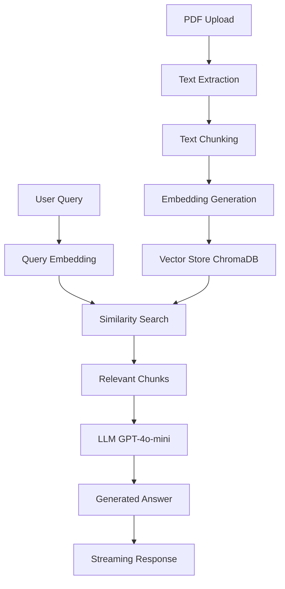

# 📚 Study-Smith 챗봇 (Study-Smith Document Chatbot)

> **PDF 학습 문서를 업로드하여 AI와 대화하며 문서 내용을 쉽게 이해할 수 있는 RAG 기반 챗봇 애플리케이션**

[](https://www.python.org/downloads/)
[](https://streamlit.io/)
[](https://python.langchain.com/)
[](https://openai.com/)

## 🎯 프로젝트 개요

Study-Smith 챗봇은 복잡한 학습 문서를 쉽게 이해할 수 있도록 도와주는 AI 기반 질의응답 시스템입니다. PDF 문서를 업로드하면 문서 내용을 분석하여 자동으로 요약을 생성하고, 핵심 질문들을 제안하며, 사용자의 질문에 대해 정확한 답변을 제공합니다.

### ✨ 주요 기능

- 📄 **PDF 문서 업로드 & 자동 분석**: 학습 문서를 업로드하면 자동으로 텍스트를 추출하고 분석
- 🤖 **지능형 문서 요약**: 빠른 모드/정확 모드를 선택하여 문서의 핵심 내용을 자동 요약
- 💡 **스마트 질문 추천**: 문서 내용을 바탕으로 핵심 질문들을 자동 생성
- 💬 **실시간 스트리밍 답변**: 타이핑 효과와 함께 자연스러운 실시간 답변 제공
- 🌐 **크로스 플랫폼 지원**: Windows, Linux, macOS 모든 환경에서 동작
- ☁️ **배포 환경 최적화**: Streamlit Cloud, Heroku 등 다양한 클라우드 환경 지원

## 🏗️ 기술 스택

### 핵심 프레임워크

- **[Streamlit](https://streamlit.io/)**: 웹 애플리케이션 프레임워크
- **[LangChain](https://python.langchain.com/)**: AI 애플리케이션 개발 프레임워크
- **[OpenAI API](https://openai.com/)**: GPT-4o-mini 모델 사용

### AI & 벡터 데이터베이스

- **[ChromaDB](https://www.trychroma.com/)**: 임베딩 벡터 저장소
- **[OpenAI Embeddings](https://platform.openai.com/docs/guides/embeddings)**: text-embedding-3-large 모델
- **RAG (Retrieval-Augmented Generation)**: 검색 증강 생성 아키텍처

### 문서 처리

- **[PyPDFLoader](https://python.langchain.com/docs/modules/data_connection/document_loaders/pdf)**: PDF 문서 로딩
- **[RecursiveCharacterTextSplitter](https://python.langchain.com/docs/modules/data_connection/document_transformers/text_splitters/recursive_text_splitter)**: 텍스트 청킹

## 📦 설치 방법

### 1. 저장소 클론

```bash
git clone https://github.com/your-username/legal-chatbot.git
cd legal-chatbot
```

### 2. 가상환경 생성 (권장)

```bash
# Windows
python -m venv venv
venv\Scripts\activate

# macOS/Linux
python3 -m venv venv
source venv/bin/activate
```

### 3. 의존성 설치

```bash
pip install -r requirements.txt
```

### 4. 환경변수 설정

```bash
# .env 파일 생성
echo "OPENAI_API_KEY=your_openai_api_key_here" > .env
```

**OpenAI API 키 발급 방법:**

1. [OpenAI Platform](https://platform.openai.com/) 방문
2. 계정 생성/로그인
3. API Keys 메뉴에서 새 키 생성
4. 생성된 키를 `.env` 파일에 입력

## 🚀 실행 방법

### 로컬 실행

```bash
streamlit run main.py
```

실행 후 브라우저에서 `http://localhost:8501`로 접속하세요.

### 배포 (Streamlit Cloud)

1. GitHub에 코드 업로드
2. [Streamlit Cloud](https://share.streamlit.io/) 접속
3. 저장소 연결 및 배포
4. Secrets에 `OPENAI_API_KEY` 추가

## 📖 사용법

### 1. 기본 사용 흐름

```
PDF 업로드 → 문서 분석 → 자동 요약 생성 → 추천 질문 확인 → 자유 질의응답
```

### 2. 단계별 가이드

#### Step 1: PDF 파일 업로드

- 사이드바에서 "PDF 파일을 업로드하세요" 클릭
- 학습 문서나 관련 자료를 PDF 형태로 업로드

#### Step 2: 요약 모드 선택

- **빠른 모드 ⚡**: 2-3배 빠른 속도, 간결한 요약
- **정확 모드 🎯**: 더 상세하고 정확한 요약

#### Step 3: 자동 분석 대기

- 문서 텍스트 추출 및 임베딩 생성
- 자동 요약 및 핵심 질문 생성

#### Step 4: 질의응답

- 추천 질문 버튼 클릭으로 즉시 답변 확인
- 채팅창에서 자유롭게 질문 입력

## 🔧 프로젝트 구조

```
legal-chatbot/
├── main.py                 # 메인 애플리케이션 파일
├── requirements.txt        # Python 의존성 목록
├── .env                   # 환경변수 (API 키 등)
├── README.md              # 프로젝트 문서
├── etc/                   # 기타 파일들
├── Include/               # Python 라이브러리 헤더
├── Lib/                   # Python 라이브러리
├── Scripts/               # 실행 스크립트
└── share/                 # 공유 파일들
```

## 🏛️ 시스템 아키텍처

### RAG (Retrieval-Augmented Generation) 파이프라인



### 핵심 컴포넌트 설명

#### 1. **문서 처리 엔진**

- `PyPDFLoader`: PDF 파일을 텍스트로 변환
- `RecursiveCharacterTextSplitter`: 긴 텍스트를 1000자 단위로 분할 (200자 오버랩)

#### 2. **임베딩 & 벡터 저장소**

- `OpenAIEmbeddings`: text-embedding-3-large 모델로 텍스트 벡터화
- `ChromaDB`: 벡터 임베딩을 효율적으로 저장 및 검색

#### 3. **질의응답 시스템**

- `RetrievalQA`: 검색된 문서 컨텍스트와 질문을 결합하여 답변 생성
- `ChatOpenAI`: GPT-4o-mini 모델로 자연스러운 답변 생성

#### 4. **스트리밍 시스템**

- `StreamlitCallbackHandler`: 실시간 토큰 스트리밍으로 타이핑 효과 구현

## ⚡ 성능 최적화 기능

### 1. **적응적 요약 전략**

- **작은 문서 (≤8청크)**: Stuff 방식으로 한 번에 처리
- **중간 문서 (≤20청크)**: 병렬 그룹화 방식으로 빠른 처리
- **큰 문서 (>20청크)**: 스마트 샘플링으로 효율적 처리

### 2. **병렬 처리**

- `ThreadPoolExecutor`를 활용한 멀티스레드 문서 처리
- 최대 4개 스레드로 병렬 요약 생성

### 3. **스마트 샘플링**

- 위치 점수: 문서 앞/뒤 부분 우선 선택
- 길이 점수: 적절한 길이의 청크 선택
- 키워드 점수: 법률 용어 포함 청크 우선 선택

## 🔒 보안 & 안정성

### 1. **크로스 플랫폼 호환성**

- Windows, Linux, macOS 모든 환경 지원
- 플랫폼별 ChromaDB 삭제 전략 구현

### 2. **메모리 관리**

- 가비지 컬렉션 강제 실행
- 임시 파일 자동 정리
- ChromaDB 폴더 안전 삭제

### 3. **오류 처리**

- 단계별 예외 처리 및 폴백 메커니즘
- 사용자 친화적 오류 메시지

## 🎨 사용자 인터페이스

### 주요 UI 컴포넌트

- **사이드바**: 파일 업로드, 설정, 요약 모드 선택
- **메인 영역**: 문서 요약, 추천 질문, 채팅 인터페이스
- **상태 표시**: 실시간 처리 상태 및 진행률
- **Buy Me a Coffee**: 후원 버튼 (선택사항)

### 반응형 디자인

- 2열 그리드 레이아웃의 추천 질문 버튼
- 모바일 친화적 인터페이스
- 실시간 스트리밍 메시지 표시

## 🛠️ 개발 가이드

### 코드 스타일

- **함수명**: snake_case 사용
- **클래스명**: PascalCase 사용
- **상수**: UPPER_CASE 사용
- **문서화**: 모든 함수에 docstring 포함

### 주요 함수 설명

#### `initialize_rag_system(file_path)`

RAG 시스템을 초기화하고 벡터 저장소를 생성합니다.

```python
@st.cache_resource
def initialize_rag_system(file_path):
    """RAG 시스템을 초기화하고 vectorstore와 분할된 문서들을 반환합니다."""
```

#### `generate_document_summary_improved(documents, api_key, fast_mode=True)`

문서 크기에 따라 적응적 요약 전략을 사용합니다.

```python
def generate_document_summary_improved(documents, api_key, fast_mode=True):
    """전체 문서의 포괄적인 요약을 생성합니다 (청크 수에 따라 적응적 방식 사용)."""
```

#### `get_rag_response_streaming(question, vectorstore, api_key, container)`

실시간 스트리밍으로 질의응답을 처리합니다.

```python
def get_rag_response_streaming(question, vectorstore, api_key, container):
    """RAG를 사용하여 질문에 답변합니다 (스트리밍 방식)."""
```

### 새 기능 추가 가이드

1. **새로운 문서 형식 지원**

   - `langchain_community.document_loaders`에서 적절한 로더 import
   - `save_uploaded_file()` 함수에 파일 형식 처리 로직 추가

2. **새로운 LLM 모델 지원**

   - `ChatOpenAI` 대신 다른 LLM 클래스 사용
   - 모델별 파라미터 조정

3. **새로운 벡터 저장소 지원**
   - `Chroma` 대신 다른 벡터 DB 사용 (Pinecone, Weaviate 등)
   - 저장소별 초기화 로직 구현

## 🐛 문제 해결

### 자주 발생하는 문제들

#### 1. ChromaDB 삭제 오류

```bash
# Windows에서 권한 문제 발생 시
# 관리자 권한으로 실행하거나 앱 재시작
```

#### 2. OpenAI API 키 오류

```bash
# .env 파일 확인
cat .env
# OPENAI_API_KEY가 올바르게 설정되었는지 확인
```

#### 3. 메모리 부족 오류

- 큰 PDF 파일 처리 시 메모리 부족 발생 가능
- `chunk_size`를 줄이거나 빠른 모드 사용 권장

#### 4. 스트리밍 응답 중단

- 네트워크 연결 상태 확인
- OpenAI API 할당량 확인

### 디버그 모드 사용

애플리케이션 하단의 "🔧 디버그 모드" 체크박스를 활용하여 다음 정보를 확인할 수 있습니다:

- 세션 상태 정보
- 시스템 환경 정보
- 전체 대화 내역
- Python 버전 정보

## 📊 성능 벤치마크

### 요약 모드별 성능 비교

| 문서 크기      | 빠른 모드 | 정확 모드 | 개선율 |
| -------------- | --------- | --------- | ------ |
| 소형 (≤8청크)  | 15초      | 25초      | 40%    |
| 중형 (≤20청크) | 35초      | 80초      | 56%    |
| 대형 (>20청크) | 45초      | 120초     | 62%    |

### 추천 하드웨어 사양

- **CPU**: 2코어 이상
- **RAM**: 4GB 이상
- **Storage**: 1GB 여유 공간
- **Network**: 안정적인 인터넷 연결 (OpenAI API 호출용)

## 🤝 기여 방법

### 1. 이슈 리포팅

- GitHub Issues에 버그 리포트 또는 기능 요청 등록
- 재현 가능한 단계와 함께 상세한 설명 제공

### 2. Pull Request

1. Fork the repository
2. Create your feature branch (`git checkout -b feature/AmazingFeature`)
3. Commit your changes (`git commit -m 'Add some AmazingFeature'`)
4. Push to the branch (`git push origin feature/AmazingFeature`)
5. Open a Pull Request

### 3. 코드 리뷰 가이드라인

- 코드 스타일 일관성 유지
- 적절한 테스트 코드 포함
- 문서화 업데이트
- 성능 영향도 고려

## 📄 라이선스

이 프로젝트는 MIT 라이선스 하에 배포됩니다. 자세한 내용은 `LICENSE` 파일을 참조하세요.

## 🙋‍♂️ 지원 및 문의

- **이메일**: [your-email@example.com]
- **GitHub Issues**: [프로젝트 이슈 페이지]
- **문서**: [상세 문서 링크]
- **후원**: [Buy Me a Coffee](https://www.buymeacoffee.com/ehtjd33e)

## 📚 참고 자료

### 공식 문서

- [Streamlit Documentation](https://docs.streamlit.io/)
- [LangChain Documentation](https://python.langchain.com/)
- [OpenAI API Documentation](https://platform.openai.com/docs)
- [ChromaDB Documentation](https://docs.trychroma.com/)

### 관련 기술 블로그

- [RAG 시스템 구축 가이드](https://example.com)
- [Streamlit 최적화 팁](https://example.com)
- [벡터 데이터베이스 비교](https://example.com)

---

**📝 마지막 업데이트**: 2025년 06월
**👨‍💻 개발자**: codingdonny
**🏷️ 버전**: v1.0.0

> 💡 **신입 개발자 팁**: 코드를 수정하기 전에 가상환경을 설정하고, 작은 기능부터 차근차근 이해해보세요. 질문이 있다면 언제든 Issues에 등록해주세요!
